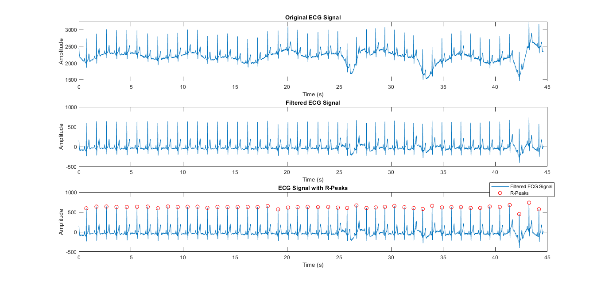
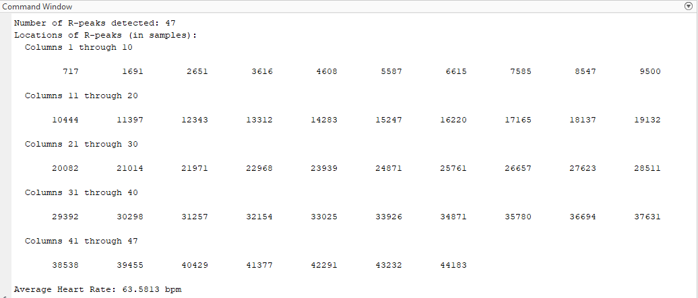
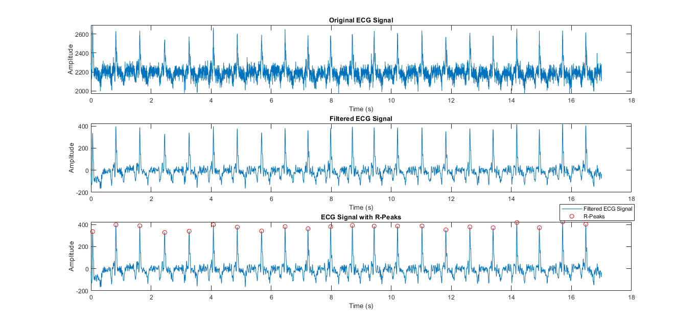
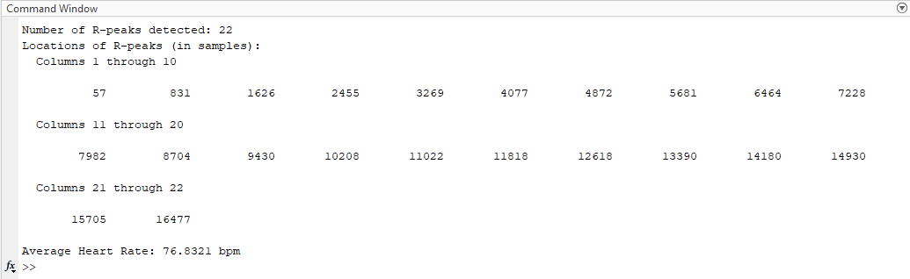

# 🫀 ECG Heart Rate Detector (MATLAB)

This MATLAB project detects R-peaks from ECG signals and estimates the average heart rate (in bpm) using signal processing techniques. The project includes preprocessing, peak detection, and visualization steps to demonstrate heart rate calculation.

## ⚙️ Features

- Load ECG signal data from `.mat` files  
- Apply bandpass filtering (0.5–50 Hz) to remove noise  
- Detect R-peaks using MATLAB’s `findpeaks()`  
- Calculate RR intervals and average heart rate 
- Plot original, filtered ECG, and ECG with R-peaks  

## 📂 Project Structure

ECG-HeartRate-Detector/
  ├── ecg_heartbeat.m → Main MATLAB script
  ├── ecgdemodata1.mat → Sample ECG signal 1
  ├── ecgdemodata2.mat → Sample ECG signal 2
  ├── Images/ → Output screenshots
    │ ├── ecg_plot_data1.png
    │ ├── ecg_plot_data2.png
    │ ├── ecg_output_data1.png
    │ ├── ecg_output_data2.png
    │ └── ecg_output_data1.png
  ├── README.md → Project documentation
  └── LICENSE → MIT License

## 🧪 Sample Inputs

The project includes two sample ECG datasets for testing:

- `ecgdemodata1.mat`
- `ecgdemodata2.mat`

## 📸 Output Snapshots

### Example 1: ecgdemodata1.mat  

**ECG Signal with R-Peaks**  

**R-Peak Data & Heart Rate Output**  

### Example 2: ecgdemodata2.mat  

**ECG Signal with R-Peaks**  

**R-Peak Data & Heart Rate Output**  

## 📖 License

This project is licensed under the [MIT License](LICENSE).

## 🙋‍♂️ Author

Midhun P S  
Sree Chitra Thirunal College of Engineering, Trivandrum
